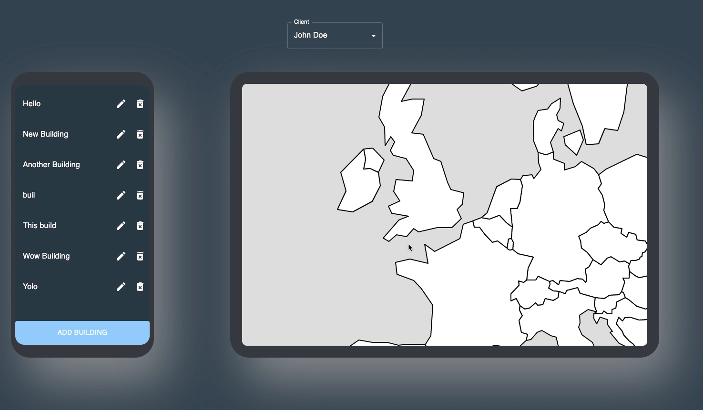
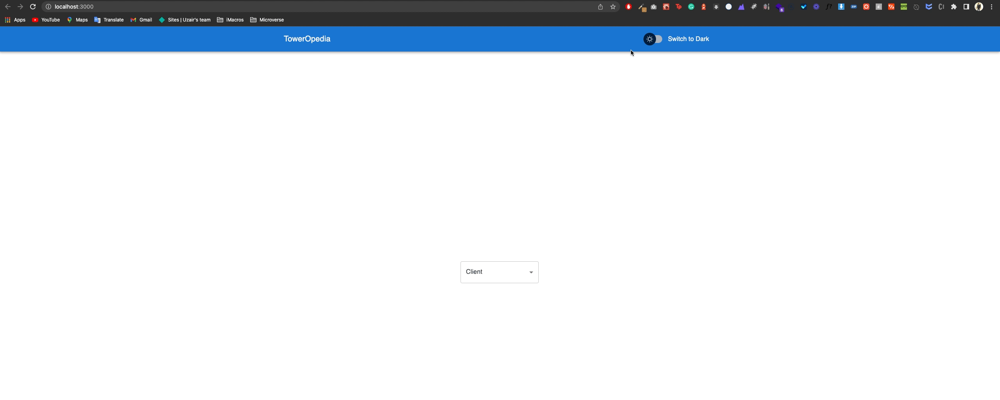

# TowerOpedia

> This app is to view, add or delete data for building owners. In this app, the clients are the building owners so the user has option to select their respective username to view the data for them. The application is a MERN stack app . It follows the CRUD convention. As per the requirements the app doesnot contain the ability to create or edit clients, although to add it working I had to create a seperate route for that, this can be tested on the server via Postman or browser. The application enhances the CRUD operations to it's child Schema "Buildings" which is directly owned by the parent client profile. Whole project is based on the MaterialUI library, the project also has it's custom theme to make use of the MaterialUI dark mode option.

# Demo

 


# Test it yourself

[Live link](https://suspicious-euler-3f0223.netlify.app/)


## Built With

- Javascript
- HTML
- CSS
- JavaScript
- TypeScript
- React
- Redux
- Node.js
- Express.js
- MongoDB Atlas
- MaterialUi
- Leaflet
- React-leaflet

## Prerequisites

- Node.js
- Npm
- Nodemon

## Getting Started

To get a local copy up and running follow these simple example steps. 👇

***Please note, the application data relies on the server, unless you plan or have setup your own server, it is recommended to please complete the server side process first***

### Cloning the Github Repo

```bash
# To clone the git repository
git clone https://github.com/uzairali19/toweropedia.git
```

### Server Side

```bash
# Navigate to server folder
cd toweropedia/server

# Installing dependencies
npm install

# Startup the server
npm run start
```

### Client Side

```bash
# Navigate to project folder
cd toweropedia

# Installing dependencies
npm install

# To run development branch
npm run start

# To build the project
npm run build

# To run tests on the project
npm run test
```

### Check Errors:

```bash
# To check for TypeScript and CSS errors
npm run lint
```
---

## Usage:

- To see the application select a client from the list below.
- Application shows Two components, `BuildingList` and `BuildingsMap`, to view a building on the map click the building to `FlyTo` the location of the building.
- To `Edit` a building click on edit against the respective building to open the form and populate the data with the building data.
- To `Delete` a building click on the delete icon against the respective building to open the form and populate the data with the building data.
- To `Add` a building click on the Add button at the end of the form to open the form with empty values to add to the Building list.
- After `Add`/`Edit` the map renders to show the respective building on the map.

---
## To improve

If a user is editing a building data and wants to edit another building, a same instance should call to check if the user data is not equal to the prevState data that was passed on the form. In that case the map should not appear and the form should populate the new building values to edit.



There can be a user preference setting system. So that on default the application would stay on the preffered mode `Light` or `Dark` to view the content, however if the user has not selected a mode explicity on the application the default mode can be the `system` setting of the user. This will prevent the application to go into a set default mode on refresh or load, in this case `Light` mode, providing more natural and better experience.




## Author

👤 **Uzair Ali**

- GitHub: [@uzairali19](https://github.com/uzairali19)
- Twitter: [@uzairali751](https://twitter.com/Uzairali751)
- LinkedIn: [Uzair Ali](https://www.linkedin.com/in/uzairali19/)

## 🤝 Contributing

Contributions, issues, and feature requests are welcome!

Feel free to check the [issues page](https://github.com/uzairali19/toweropedia/issues/).

## Show your support 👍

Give a ⭐️ if you like this project!

## 📝 License

This project is [MIT](./MIT.md) licensed.